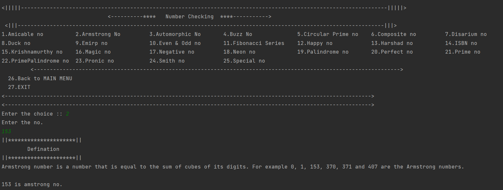

# Number-Checking-System-using-Java

***This 'Number Checking System' using Java is created by Ankita Sikder, student of BTECH, in University of Engineering and Management, Kolkata.***

**Email Id: ankita.sikder14@gmail.com.** 

**Contact No: 8583939774.** 

<p align="left">
<a href="https://facebook.com/ankita.sikder.104" target="blank"></a>
<a href="https://instagram.com/ankita.sikder14" target="blank"></a>
<a href="https://github.com/biswa2210/ankitasikder" target="blank"></a>
</p>

[](https://shields.io/) [](https://shields.io/) [](https://shields.io/) [](https://shields.io/) [](https://shields.io/)

## About :point_down:

<div align="justified">
     

</div>

## Applications :point_down:


## Future Scopes :point_down:


## Folder Structure :point_down:

```bash
JDBC-STUDENT-RECORD-SYSTEM
     ├── .settings
     ├── bin
     ├── src
     |     ├── com/student/manage
     |     |         ├── ConnectionMethods.class
     |     |         ├── ConnectionMethods.java
     |     |         ├── ConnectionProvider.java
     |     |         ├── ConnectionProvider.class
     |     |         ├── Student.java
     |     |         └── Student.class
     |     ├── start.class
     |     ├── start.java
     |     └── menu.class 
     └── .project
```                      

## Screenshots of NCS :point_down: 

<div align="center">
 
<a href="pics/ncs1.png"></a> 
 
<a href="pics/ncs2.png"></a> 
  
<a href="pics/ncs3.png"></a> 
  
<a href="pics/ncs4.png"></a> 
  
<a href="pics/ncs5.png"></a> 


</div>


